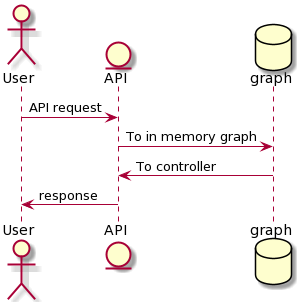

# Contoso-gaming-engine
Gaming engine for Contoso Games

[](https://github.com/amanbedi18/Contoso-gaming-engine/actions/workflows/ContosoGamingEngineAPI-build.yml)

[](https://github.com/amanbedi18/Contoso-gaming-engine/actions/workflows/ContosoGamingEngineAPI-deploy.yml)


## Problem Statement

The goal is to build an API to locate the actors in the game. All actors are tagged to the Landmarks and the purpose of the API is to provide routes between landmarks to suggest routes to the actors.  In order to achieve this, the game engine should be able to calculate:

- The distance along certain routes via landmarks
- The number of different routes between landmarks


## Non-Functional Requirements

- Use C#, Java or Python
- Deploy & host on AWS
- Integrate the API with Swagger UI for testing
- Document assumptions made
- Unit test
- Approach for SCM & DevOps (CI-CD)
- Easy to extend design
- In memory data-store but should be extendable to Db later


## Solution Implementation

The following tech stack is used to develop the API:

| Component                          | Technology                                                   |
| ---------------------------------- | ------------------------------------------------------------ |
| API                                | Microsoft ASP.NET Core 5.0                                   |
| Code Analysis                      | Microsoft NetAnalyzers, StyleCop Analyzers                   |
| Swagger                            | Swashbuckle AspNetCore                                       |
| Middleware for error handling      | Hellang Middleware for ProblemDetails                        |
| Exception Handling                 | AspNet Mvc Filter                                            |
| Dependency Injection               | Built in dependency injection in ASP.NET Core, Microsoft Dependency Injection extension in Unit tests |
| Unit testing                       | Xunit, Microsoft .NET Test SDK, Moq, Coverlet code coverage collector |
| Logging                            | Azure App Insights                                           |
| SCM (source control management)    | GitHub                                                       |
| DevOps (CI-CD)                     | GitHub Actions                                               |
| Hosting - AWS (primary)            | AWS (EC2 & Elastic Beanstalk)                                |
| Hosting - Microsoft Azure (backup) | Azure App Service                                            |
| Tools                              | Microsoft Visual Studio, AWS extension for Visual Studio, VS Code |


## Deployed URL's
Below are the URL's for deployed API:
- [AWS](http://contosogaminapi-dev.ap-south-1.elasticbeanstalk.com/swagger/index.html)
- [Azure](https://contosogamingengineapi.azurewebsites.net/swagger/index.html)


## How to use

### API Endpoints
The Contoso Gaming Engine API has the following 3 endpoints:


1. GET ​
```
/api​/v{version}​/locateplayers​/{source}​/{destination}
```

- Gets all possible routes with their weights from source to destination

2. GET 
```
/api​/v{version}​/locateplayers​/{source}​/{destination}​/{hops}
```

- Gets all possible routes with their weights from source to destination for given number of maximum hops

3. POST
```
/api​/v{version}​/locateplayers​/findroutes
{
   "source": "A", #source should not be same as destination
   "destination": "E"
   "landmarks": {
        "B",
        "C",
        "D"
    }
}
```

- Gets all possible routes with their weights from source to destination for given landmarks

### In memory graph

The following is in memory graph representation for the below inputs:
Vertices: A, B, C, D, E
Edges with weights: AB3, BC9, CD3, DE6, AD4, DA5, CE2, AE4, EB1


## Sample Runs


1. GET All routes from source to destination (happy path):


2. GET All routes from source to destination (source node not in graph):


3. GET All routes from source to destination (same source and destination):


4. GET All routes from source to destination (empty source and destination):


5. GET All routes from source to destination for given number of maximum hops (happy path):


6. GET All routes from source to destination for given number of maximum hops (happy path):


7. GET All routes from source to destination for given number of maximum hops (destination node not in graph):


8. GET All routes from source to destination for given number of maximum hops (empty source and destination):


9. GET All routes from source to destination for given number of maximum hops (same source and destination):


10. GET All routes from source to destination for given number of maximum hops (negative hops):


11. POST All possible routes with their weights from source to destination for given landmarks (happy path):


12. POST All possible routes with their weights from source to destination for given landmarks (happy path):


13. POST All possible routes with their weights from source to destination for given landmarks (no path):


14. POST All possible routes with their weights from source to destination for given landmarks (no source):


15. POST All possible routes with their weights from source to destination for given landmarks (landmark not in graph):


16. POST All possible routes with their weights from source to destination for given landmarks (same source and destination):


17. POST All possible routes with their weights from source to destination for given landmarks (empty source & destination):


18. POST All possible routes with their weights from source to destination for given landmarks (empty landmarks):


19. POST All possible routes with their weights from source to destination for given landmarks (landmarks contain source and destination):


20. POST All possible routes with their weights from source to destination for given landmarks (source not in graph):


## Design
Below section details the high level & low level design of the solution

### High Level Design

The high level design consists of the following components:



- The user makes Http GET or POST request to the REST API
- The API performs validations, calls internal services & serves the response to the user's request
- In memory graph is leveraged as the data store
- Response is sent back to the user in JSON format


### Low Level Design

The low level design consists of the following components:


1. The user makes Http GET or POST request to the REST API which goes to RouteController
2. The controller runs basic validations on the input parameters like:

- source, destination & hops are required in get requests
- source & destination cannot be the same & landmarks cannot be empty or contain the source or destination

3. The controller calls PlayersLocatorService with appropriate parameters
4. PlayersLocatorService calls InMemoryGraph, providing values for edges & vertices alongwith weights
5. InMemoryGraph validates the incoming values for edges & vertices of the graph
6. InMemoryGraph checks whether the graph already exists in the memory, if not, it creates a new in memory graph with provided values of edges, vertices & weights.
7. InMemoryGraph returns the graph object to PlayersLocatorService
8. PlayersLocatorService runs business validations like:

- Hops should not be negative
- Source, destination & landmarks should exist in the vertices of the in memory graph

9. Validation results are returned to PlayersLocatorService
10. PlayersLocatorService call GraphService to find the requested routes & weights based on input parameters
11. GraphService returns routes with weights as result
12. Resulting list of routes with weights is mapped to API response model
13. The response model is returned to the RouteController
14. The RouteController validates the response model
15. If the response model is valid, it is returned as JSON wrapped in API Action Result, otherwise ProblemDetails JSON is returned with appropriate details for any error, exception, invalid inputs or no route found for given valid inputs


## Unit Testing

Unit tests are part of Contoso.Gaming.Engine.API.Tests project.

### Strategy to test RouteController

- Mock PlayersLocatorService
- Setup PlayersLocatorService to give expected response for various inputs
- Call RouteController methods & perform assertions for positive and negative scenarios

### Strategy to test PlayerLocatorService

- Inject actual instance of GraphService (to work against in memory graph). This will be replaced by mock repository in case of Db extension
- Call methods with actual inputs
- Perform assertions for positive and negative scenarios

### Code coverage

CI-Build runs dotnet test, test report runner & code coverage report generator

1. Dotnet test runner
[Dotnet test](https://github.com/amanbedi18/Contoso-gaming-engine/runs/3386434292?check_suite_focus=true)


2. Unit test report generator
[unit test report](https://github.com/amanbedi18/Contoso-gaming-engine/runs/3386439723?check_suite_focus=true)


3. Code coverage report (published as build artifacts, downloadable)
[coverage report](https://github.com/amanbedi18/Contoso-gaming-engine/actions/runs/1152297379)


## Exception Handling
The API leverages ASP.NET Core ProblemDetails construct to always return a standard & predictable response when there is handled/unhandled exception or custom error thrown by the applicatoin.

- Hellang ProblemDetails Middleware is configured in Startup to map any handled or unhandled exception to ProblemDetails response, it is also configured to return validation errors
- HttpResponseExceptionFilter is configured as an MVC filter in Startup. It intercepts any handled or unhandled exception, logs exception & continues the flow of http pipeline
- NotFoundException is a custom exception mapped to NotFoundProblem that implements ProblemDetails, the response is automatically mapped as per ProblemDetails middleware configuration
- DeveloperExtensionPage is enabled in Startup only if execution environment is development environment to see the exception stacktrace
- All exception / ProblemDetails logs are tracked with ASP.NET core TraceIdentifier to track the request lifecycle end-to-end


## Telemetry
Azure Application Insights is used for telemetry. TelemetryClient is injected in relevant classes & Application Insights connection string is configured in appsettings.json both during development and deployment to enable telemetry logging.


## Extensibility
To replace in memory graph by a database (preferebly NoSQL Db to represent graph) either of the following can be a good fit:
- [AWS Amazon DynamoDB](https://aws.amazon.com/dynamodb/)
- [Azure Cosmos DB Gremlin API](https://docs.microsoft.com/en-us/azure/cosmos-db/graph/graph-introduction)

To incorporate the data store in the API, a separate DAL layer following repository pattern can be created & injected into appropriate services. This can further be mocked in unit tests to enable testibility of business logic & graph code independent of DB provider.

## Infra
ARM templates are used for provisioning Azure infrastructure


AWS infrastructure is manually provisioned but automation tools like cloud formation & terraform can be used to govern infrastructure as code & incorporate in GitHub Actions.

## SCM
GitHub is used as the source control for the project. GitFlow branching strategy is used for development lifecycle.


As part of code lifecycle:

- Any code in the main branch should be deployable.
- Create new descriptively-named branches off the main branch for new work, such as feature/add-new-service.
- Commit new work to your local branches and regularly push work to the remote.
- To request feedback or help, or when you think your work is ready to merge into the main branch, open a pull request.
- After your work or feature has been reviewed and approved, it can be merged into the main branch.
- Once your work has been merged into the main branch, it should be deployed immediately.

Pull request:


- Required status check of CI-build is configured via Branch Protection rules and is required to pass in order to enable merge
- Approvers, reviewers, mandatory review comment fixes & other policies can be configured to enforce stable code merge

## DevOps
GitHub Actions are leveraged to implement CI-CD workflows

### Continuous Integration
CI workflow definition is source controlled in ContosoGamingEngineAPI-build.yml file & runs as below


CI workflow performs the following steps [sample ci build](https://github.com/amanbedi18/Contoso-gaming-engine/runs/3391029324?check_suite_focus=true):

- Checks out branch against which build-api job is run
- Setup .NET Core 5 SDK
- Install report generator tool
- Restore nuget packages
- Build API C# Code in debug configuration
- Run Unit tests
- Generate Unit test report
- Generate code coverage report
- Create code coverage report artifact
- Complete job & publish status

### Continuous Delivery
CD workflow definition is source controlled in ContosoGamingEngineAPI-deploy.yml file & runs as below


CD workflow performs the following steps [sample ci build](https://github.com/amanbedi18/Contoso-gaming-engine/runs/3386439599?check_suite_focus=true)

- Checks out branch against which build-and-deploy job is run
- Setup .NET Core 5 SDK
- Replace Application Insights connection string in appsettings.json by leveraging the value stored in GitHub secrets, loading as environment variable and tokenizing in json file
- Restore nuget packages
- Build API C# Code in release configuration
- Run Unit tests
- Package API project
- Deploy API project to Azure App Service by leveraging publish profile stored as GitHub secret, loading as environment variable and supplying to Deploy to Azure Web App action
- Publish API package as artifact
- Complete job & publish status

***Currently CD is only implemented for Azure App Service deployment, enhancements to CD workflow are required to deploy the API to AWS Elastic Beanstalk***

## Assumptions

- The API has no security requirements at the moment & can be accessed by anyone with the public endpoint
- API extensions like AWS API Gateway & Azure API Management are out of scope
- If a landmark is visited while getting routes via landmarks, it cannot be visited again
- 0 is not a valid hop count whiule getting routes from source to destination with maximum hops, negative hops are not allowed either
- In memory graph cannot exceed 10,000 nodes as current DFS implementation is recursion based which might run into stackoverflow exception due to call stack not sufficing for storing multiple method references. Iterative implementation of DFS can alleviate this in future but is not currently implemented
- Graph input is directed & weighted
- To get route along landmarks, source and destination are to be provided along with a list of landmarks which should NOT include the source and destination, Also, list of landmarks cannot be empty & in case valid landmarks are provided, they should be valid vertices of the graph (in which cases a validation error would be thrown)
- Currently same consistent data model is kept for all 3 API endpoints but this can be customized in future according to caller's requirements
- Source & destination are required and cannot be empty in any API request, further: both need to be a valid vertex present in the graph & the same value cannot be provided for both inputs (in all failure scenarios described, validation errors would be thrown)